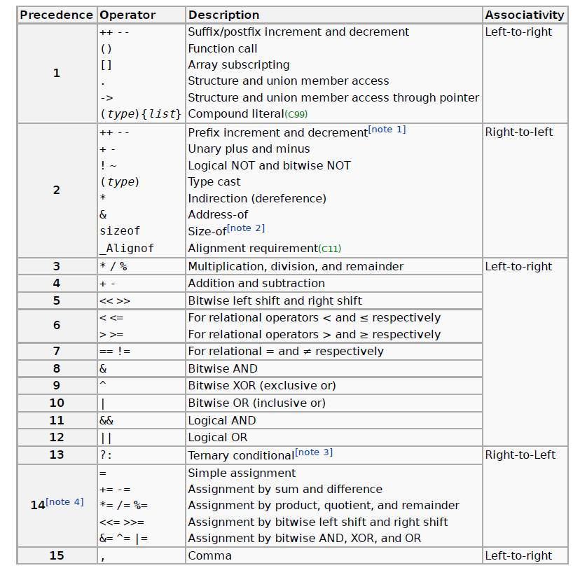

# c cheatsheet 
```c
// this is a single line comment 

/* this is 
multi-line comment */

// c have three kind of data variables , which is used to store the vlaue 
int a ;                 // integer data type generally 4 bytes
long a ; long long a ; // used for larger value can be 8 or 16 bytes
short a ;             // size is of 2 bytes 
float b; // a real value 
char a ; //its of 1 byte size and is the smallest data variable 

unsigned int a vs signed int a; 
//there is the tradeoff of the range of the value stored,
//unsigned stores the postive numbers starts from 0 and signed stores the negative numbers in 2's complement 
//form and the msb 1 bit is used for denoting the sign of the numeber 0 for positive and 1 for the negative 

// and unsigned and signed are valid for the all the data types even for the chars 
unsigned short float a ; 
```

## pointers 
```c
int* a; // this defines the pointer, which is it can store the memory location
int b=10;
a =&b; // & is read as ampersand and b when compiled get subsituted with the memory location when we define the data , the name 'b' doesnt hold any significance to the compiler but is for our readablity 
printf("%p",a); // so you use  the %p format specifier for the pointers
//%d -> integer and %f -> float and %c -> char 
printf("%d",*a); // this is called the dereferncing the pointer it will give you the value of 10, the value of 
// the variable it points to
// keep in mind: always use the respective data type pointer , like for the int you use the int* type pointer
// and for char you use the char*, the idea here is this that if you use the char pointer which is of 1 byte for the 4 byter int variable ,there is going to be mismatch issue. so better play safe!!

//Size mismatch can cause the pointer to access more or fewer bytes than expected, leading to incorrect or garbage data.

//pointer data types 
char*
int*
long long int*
float*
double*
unsigned char*
unsigned int*
unsigned long long int*
unsigned float*
unsigned double*

```
```c
uint32_t *pAddress = (uint32_t*) 0xFFFF0000;
```
> in above code you do the type cast as cause the address is the fixed number and itis treated as int and then if you try to assign a int data type to the the pointer data type, there is going to be a mismatch issue so you do the appropiate type cast.

## operators in c 


---
- `x++` vs `++x`; so both are incremnt operators and are unary in nature, can  be used before the expression and after it, so the former one is the post increment, in which the increment is done after evaluation of the expression. like `c = x++;` in this c will get the value x but not x+1, while if we have written above expression like `c =++x;` then the x will first get incremented then used ,so here the c will get x+1 value.

- we have the operator `&` which is the bitwise and operators and , this operator is used for the testing of the bits and we use the bitmasking concept to preserve the nth bit , and can also clear the bit at any position.
```
number = 7       → 00000111
1                → 00000001
----------------------------
number & 1       → 00000001 (True → Odd)

number = 6       → 00000110
1                → 00000001
----------------------------
number & 1       → 00000000 (False → Even)
```
- & and | is used to play with the bit, like the and operator is used to test and clear a bit and or is used to set a particular bit and to toggle a bit , that is to invert a particular bit just ^ with 1 it will toggle the state of the bit, that is 1 becomes 0 and 0 becomes 1.
- for each `<<` left shift opearations the value get double , like if we left shift a value by 1 it gets multiply by 2 and for n shift it will get multiply by 2n and `>>` for each right shift the value get half the original.


## Decision statement in c 
- we already know the if else and if else if else if else ladder and you can put multiple statements inside the block.
- switch case statements in c, in which we pass the switch(variable). then the variable get compared with different case value and which ever fits it execute its statements and you can insert break; and continue in it and also can include the default case , if none of the case matches then the default executes.
- ternarty operator expression?true_expre:false_express;

## loops in c 
- we have for , while and do while loops , no need to explain what they are as they are common among all languages and follows slighlty differnt syntax.
```c
while(expresssion){
    //statements;
    //increment/decrement
}

for(int i =0 ;expresssion;counter){
    //code
}
do{
    //statements
}while(condition)

```
## delays in c 
- so there are two kind of delays in c, software delays and hardware delays.
- software delays - this delays are produced using the loops 
- hardware delays - this delays are produced using the hardware timers and counters.
---
## Tips for the embedded C 
- make use of the stdint library and the exact length of the data type needed like the unsigned 8 bit int sizes, as on why we do that due to each machine kind of have int of different bytes namely the data types based on the architecture, but when we are specific then it works fine, due to we define exactly how much size we want and it helps in get rid of the portablity issue , that is differnt architecture defines differnt data type of size.
- the thing with the pointer is whenever you define any data type pointer ,C assigns the 8 byte to any type of the pointer, then you may ask whats the role of the data type defined when we declare a pointer data type, well the data type we define affects the read , write , increment and decrement of  the pointer. like when you increment a pointer like then it increase by the offset, and then offset is decided by the data type size of the pointer, so when you increment a pointer of type int then it has got the offset of the 4 bytes and it increase by 4 , when you increment it.
- uintmax_t : defines the largest fixed-width unsigned integer
possible on the system

- intmax_t : defines the largest fixed-width signed integer possible
on the system

- uintptr_t : defines a unsigned integer type that is wide enough to
store the value of a pointer.